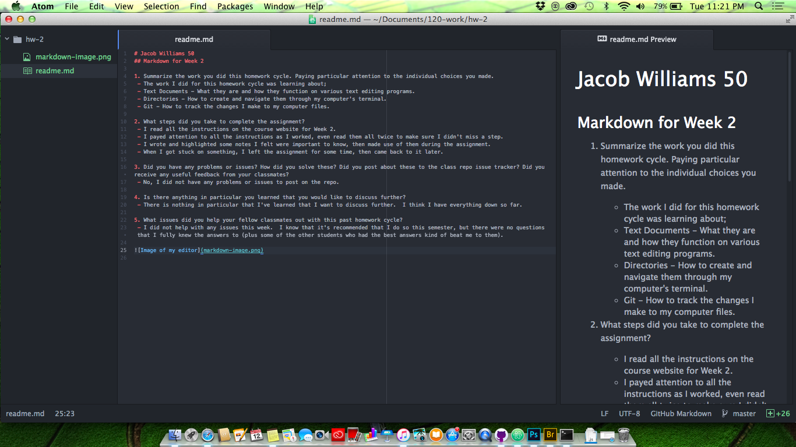

# Jacob Williams 50
## Markdown for Week 2

1. Summarize the work you did this homework cycle. Paying particular attention to the individual choices you made.
 - The work I did for this homework cycle was learning about;
 - Text Documents - What they are and how they function on various text editing programs.
 - Directories - How to create and navigate them through my computer's terminal.
 - Git - How to track the changes I make to my computer files.

2. What steps did you take to complete the assignment?
 - I read all the instructions on the course website for Week 2.
 - I payed attention to all the instructions as I worked, even read them all twice to make sure I didn't miss a step.
 - I wrote and highlighted some notes I felt were important to know, then made use of them during the assignment.
 - When I got stuck on something, I left the assignment for some time, then came back to it later.  

3. Did you have any problems or issues? How did you solve these? Did you post about these to the class repo issue tracker? Did you receive any useful feedback from your classmates?
 - No, I did not have any problems or issues to post on the repo.

4. Is there anything in particular you learned that you would like to discuss further?
 - There is nothing in particular that I've learned that I want to discuss further.  I think I have everything down so far.

5. What issues did you help your fellow classmates out with this past homework cycle?
 - I did not help with any issues this week.  I know that it's recommended that I do so this semester, but there were no questions that I fully knew the answers to (plus some of the other students who had the best answers kind of beat me to them).

