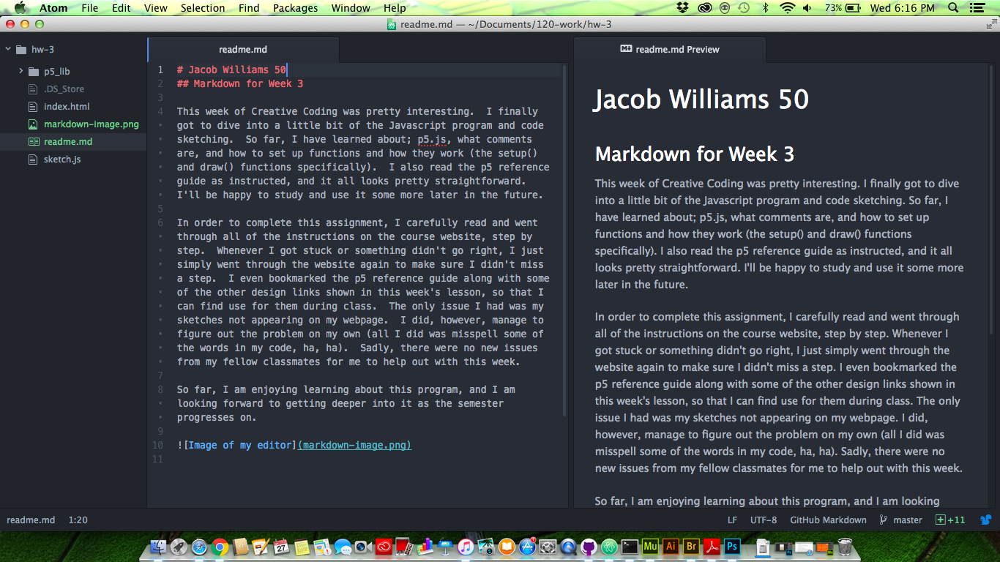

# Jacob Williams 50
## Markdown for Week 3

This week of Creative Coding was pretty interesting.  I finally got to dive into a little bit of the Javascript program and code sketching.  So far, I have learned about; p5.js, what comments are, and how to set up functions and how they work (the setup() and draw() functions specifically).  I also read the p5 reference guide as instructed, and it all looks pretty straightforward.  I'll be happy to study and use it some more later in the future.

In order to complete this assignment, I carefully read and went through all of the instructions on the course website, step by step.  Whenever I got stuck or something didn't go right, I just simply went through the website again to make sure I didn't miss a step.  I even bookmarked the p5 reference guide along with some of the other design links shown in this week's lesson, so that I can find use for them during class.  The only issue I had was my sketches not appearing on my webpage.  I did, however, manage to figure out the problem on my own (all I did was misspell some of the words in my code, ha, ha).  Sadly, there were no new issues from my fellow classmates for me to help out with this week.

So far, I am enjoying learning about this program, and I am looking forward to getting deeper into it as the semester progresses on.

