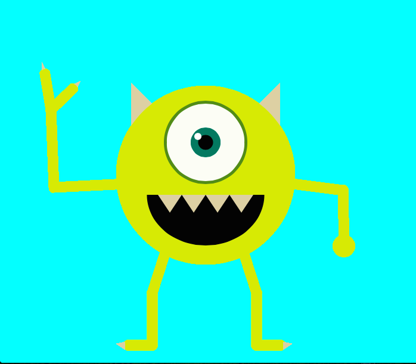
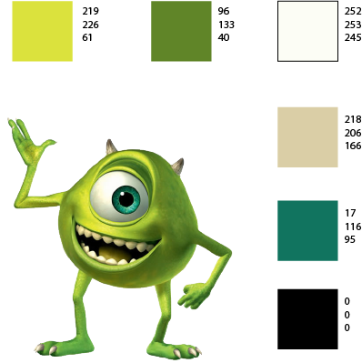

# Jacob Williams 50
## Markdown for Week 4

Another interesting week of homework, that’s a new record.  Ha, ha!  Anyway, for this week of class, I got into more of code sketches, and learned new functions like; arc(), translate(), rotate(), and scale().  I had a little bit of a hard time understanding it all at first, but with enough time reading and practicing it, I eventually pulled through.  I also learned about the Order of Operations of code sketching, and it looked pretty straightforward (a simple first to last/ top to bottom order).  I even got more into color and how to add stroke and fill color to shapes, and it was both easy and fun.  For my project, I decided to do a monster sketch.  And whom better than one of the most iconic cartoon monsters of all time, Mike Wazowski?

Before I began the my sketch, I read over all of the website content for week 4, so that I briefly understood what I was learning first.  I began my work by writing my code layout first, and then dealt with what order to put all my shapes in and where to position them as I worked.  I’m still new to code sketching, so I read through the website contents, Michael Musick's drawing examples, and the p5 reference guide as I worked, just to make sure I was going on the right path with my sketch.  I even experimented with shapes and object positioning along the way.  To avoid becoming fatigued or bored of the assignment, I took breaks in between my work process as well.

Though I completed the assignment no problem, I did have one issue I wanted to discuss.  I’m having some difficulty understanding the arc() function.  I understand the positioning and the height and width functions, I’m just having trouble with the ’start’ and ‘finish' positions.  I'll have it displayed on the issues page for more details.  Also, my GitHub Desktop is going through some technical difficulties right now (I don't know what exactly), so I had to turn in my homework on the website manually.

As for one of my fellow student’s issues, [Benji0130](https://github.com/Benji0130) was having some trouble with having with displaying and uploading his homework.  So I gave gave him some pointers and a refresh on the GitHub Desktop application.

In conclusion, I think I'm really enjoying this class so far.  I'm looking forward to the animation process next week.

Here's the full picture of my sketch.

And as a bonus, here's an image of the reference guide I made for the assignment.

